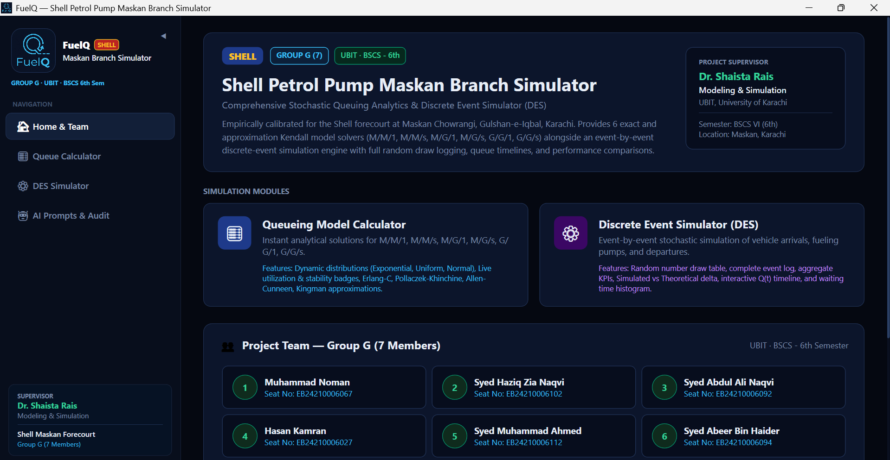
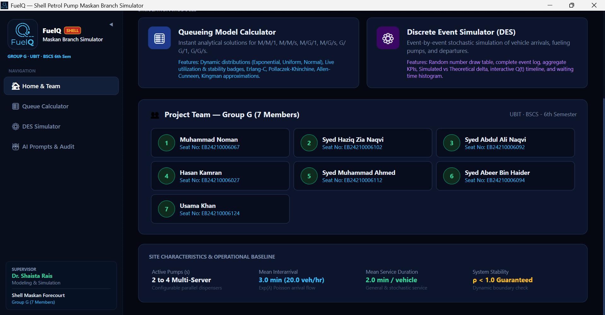
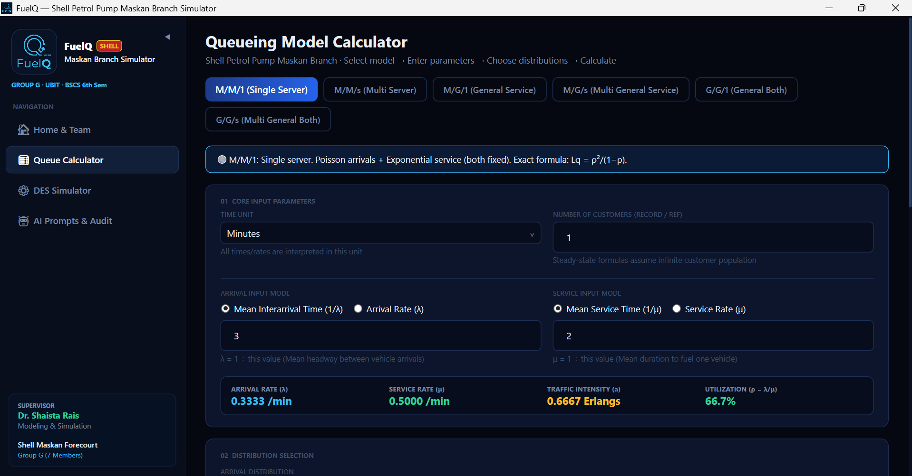
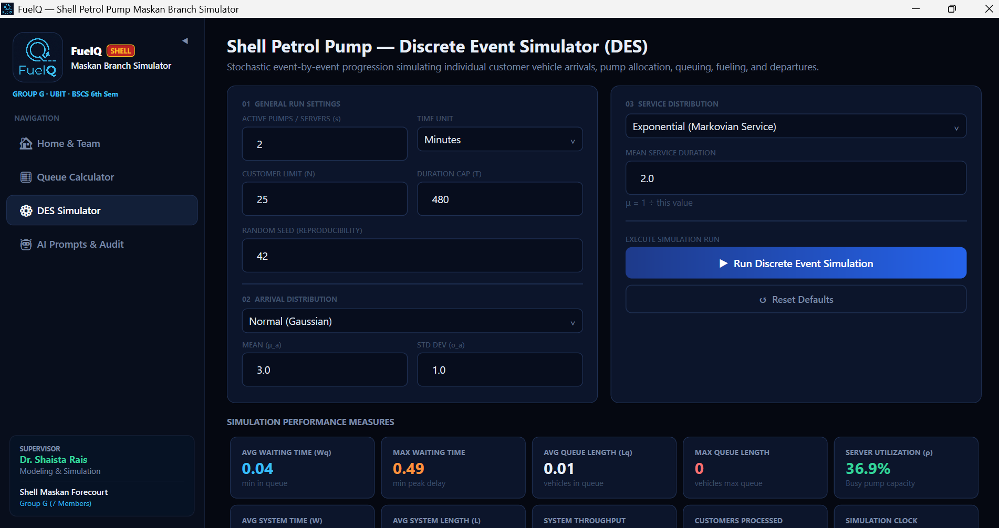
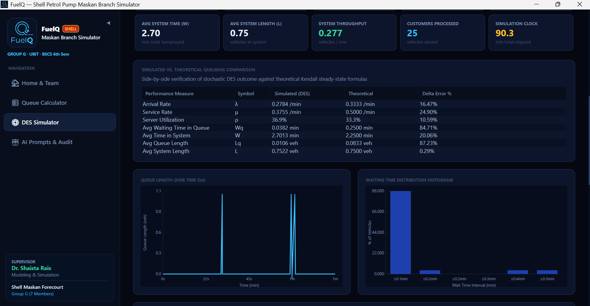

# FuelQ — Shell Petrol Pump Maskan Branch Simulator

A high-performance Windows desktop application built with **WPF and .NET 10** for the Modeling & Simulation semester project (**Group G, BSCS 6th Semester, UBIT, University of Karachi**).

FuelQ models, analyzes, and simulates the multi-server stochastic vehicle queuing system at the **Shell Petrol Pump forecourt located at Maskan Chowrangi, Gulshan-e-Iqbal, Karachi**.

---

## 🚀 How to Set Up & Run (Beginner-Friendly Guide)

If you have downloaded or cloned this project from GitHub and are using **VS Code** (or Windows PowerShell), follow these simple steps to get the app running:

---

### Step 1: Install C# & .NET (If you don't have C# installed)

To run any C# program, your computer needs the free **.NET SDK** from Microsoft.

1. **Install via PowerShell (Recommended & Fastest):**
   Open PowerShell as Administrator and run:
   ```powershell
   winget install Microsoft.DotNet.SDK.10
   ```
   *(Alternatively, download the official installer directly from the [Microsoft .NET Download Portal](https://dotnet.microsoft.com/download)).*

2. **Verify Installation:**
   Close and re-open your terminal or VS Code, then type:
   ```bash
   dotnet --version
   ```
   If it displays a version number (e.g., `10.x.x`), C# and .NET are ready!

---

### Step 2: Set Up VS Code

1. Open **Visual Studio Code**.
2. Press `Ctrl + Shift + X` (or click the Extensions icon on the left).
3. Search for **C#** (by Microsoft) and click **Install**.

---

### Step 3: Open and Run FuelQ

1. **Open the Project Folder:**
   In VS Code, go to **File $\rightarrow$ Open Folder...** and select the downloaded `FuelQ` folder.

2. **Open the Integrated Terminal:**
   Press ``Ctrl + ` `` (backtick) or go to **Terminal $\rightarrow$ New Terminal**.

3. **Run the Project:**
   Type the following command and press **Enter**:
   ```bash
   dotnet run
   ```

   *The project will automatically compile and launch the FuelQ desktop application window.*

> **📦 Dependencies Note:** **Zero external packages or installations needed.** Everything in FuelQ (including custom charts, statistical distributions, and the simulation engine) is written in native C# / WPF.

---

## 🖼️ Application Preview

### 1. Home Dashboard & Overview
*Comprehensive project background, supervisor information, navigation cards, and academic context.*



---

### 2. Project Team & Operational Baseline
*Team member details, site baseline metrics (2-4 multi-server pumps, mean headway, stability guarantee).*



---

### 3. Queueing Model Calculator
*Analytical solvers across Kendall models with live traffic intensity, utilization badges, and distribution parameters.*



---

### 4. Discrete Event Simulator (DES) Configuration
*Event-driven stochastic simulation engine with custom distributions (Exponential, Normal, Uniform, Gamma) and KPI cards.*



---

### 5. Simulation Verification & Interactive Charts
*Theoretical vs. Simulated side-by-side delta error validation, dynamic Queue Length timeline $Q(t)$, and Waiting Time Histogram.*



---

## 🌟 Key Features

* **Analytical Queueing Solvers:** Exact and approximation solutions for 8 Kendall models: $M/M/1$, $M/M/s$ (Erlang-C), $M/G/1$ (Pollaczek-Khinchine), $M/G/s$ (Allen-Cunneen), $G/G/1$ (Kingman), $G/G/s$, $M/D/1$, and $M/E_k/1$.
* **Discrete Event Simulation (DES):** Priority-queue stochastic simulator supporting Exponential, Normal (Box-Muller), Uniform, and Gamma distributions with multi-pump shortest-queue routing.
* **Forecourt-Specific Modeling:** Tailored simulation calibrated for Shell Maskan with a 70/30 motorcycle/car fleet mix and cash vs. card lane segregation.
* **Empirical Data & Goodness-of-Fit:** 320-vehicle observation dataset, IQR outlier filtering, and a Chi-Square ($\chi^2$) Goodness-of-Fit test ($\alpha = 0.05$).
* **Model Benchmarking & Sensitivity:** Side-by-side analytical vs. simulated validation, $L_q \text{ vs } \rho$ sensitivity curves, and one-click LaTeX table exports.
* **AI Prompts & Engineering Audit:** Complete transparency log of prompt engineering and architectural validation.

---

## 📐 Mathematical Formulas Reference

| Kendall Model | Queue Length ($L_q$) / Wait Time ($W_q$) Formula | Classification |
| :--- | :--- | :--- |
| **$M/M/1$** | $L_q = \frac{\rho^2}{1 - \rho}$ | Exact closed-form |
| **$M/M/s$** | $L_q = \frac{C(s, a) \cdot \rho}{1 - \rho}$ *(where $C(s, a)$ is Erlang-C)* | Exact closed-form |
| **$M/G/1$** | $W_q = \frac{\lambda (\sigma^2 + 1/\mu^2)}{2(1 - \rho)}$ *(Pollaczek-Khinchine)* | Exact mean-value |
| **$M/G/s$** | $W_q \approx \left(\frac{1 + C_s^2}{2}\right) W_q(M/M/s)$ *(Allen-Cunneen)* | Approximation |
| **$G/G/1$** | $W_q \approx \left(\frac{C_a^2 + C_s^2}{2}\right) \left(\frac{\rho}{1 - \rho}\right) \frac{1}{\mu}$ *(Kingman)* | Heavy-traffic approximation |
| **$G/G/s$** | $W_q \approx \left(\frac{C_a^2 + C_s^2}{2}\right) W_q(M/M/s)$ *(Allen-Cunneen)* | Approximation |
| **$M/D/1$** | $L_q = \frac{\rho^2}{2(1 - \rho)}$ *(Deterministic service, $\sigma = 0$)* | Exact closed-form |
| **$M/E_k/1$** | $L_q = \left(\frac{1 + k}{2k}\right) \frac{\rho^2}{1 - \rho}$ *(Erlang-$k$ service)* | Exact closed-form |

---

## 🏗️ Repository Structure

```
FuelQ/
├── Assets/                        # Visual assets (app logo, UI screenshots)
│   ├── AppLogo.jpg
│   └── screenshot-01..05.png
├── Controls/                      # Custom WPF DrawingContext vector charts
│   └── SimpleWpfChart.cs
├── Distributions/                 # Mathematical distribution samplers
│   ├── IDistribution.cs
│   ├── ExponentialDistribution.cs
│   ├── NormalDistribution.cs
│   └── UniformDistribution.cs
├── Models/                        # Domain entities & result records
├── Simulation/                    # Discrete Event Simulator Engine
├── Statistics/                    # Analytical calculators & Chi-Square test
├── Views/                         # UI Views (XAML & code-behind)
├── App.xaml / App.xaml.cs         # Application entry point & dark theme styles
├── MainWindow.xaml / .cs          # Shell navigation host & sidebar
└── FuelQ.csproj                   # Project configuration (.NET 10 WPF)
```

---

## 👥 Academic Context & Team Credits

| Attribute | Information |
| :--- | :--- |
| **Course** | Modeling & Simulation |
| **Supervisor** | **Dr. Shaista Rais** |
| **Institution** | **Department of Computer Science (UBIT), University of Karachi** |
| **Semester** | BSCS 6th Semester |
| **Lead Developer & Architect** | **Syed Haziq Zia Naqvi** |
| **Project Group (Group G)** | • Muhammad Noman<br>• Syed Abdul Ali Naqvi<br>• Hasan Kamran<br>• Syed Muhammad Ahmed<br>• Syed Abeer Bin Haider<br>• Usama Khan |
| **Study Site** | Shell Petrol Pump, Maskan Chowrangi, Gulshan-e-Iqbal, Karachi |

---

## 📄 License & Specifications

[](https://dotnet.microsoft.com/)
[](https://learn.microsoft.com/en-us/dotnet/desktop/wpf/)
[](LICENSE)
[](FuelQ.csproj)

This project is licensed under the [MIT License](LICENSE).
Feel free to use and adapt this project for academic and educational purposes.

---

*FuelQ — Modeling real-world queuing theory, one pump at a time.*
